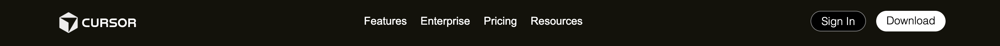
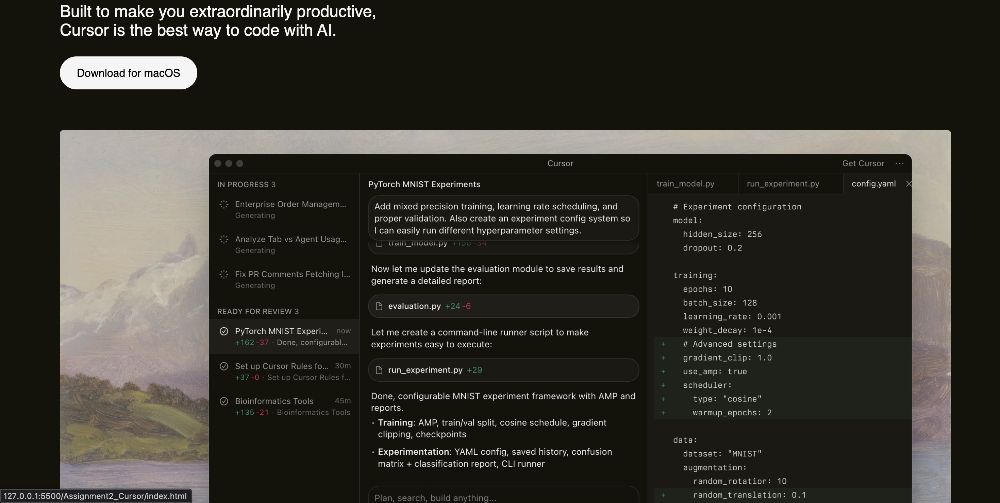
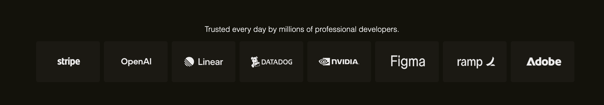
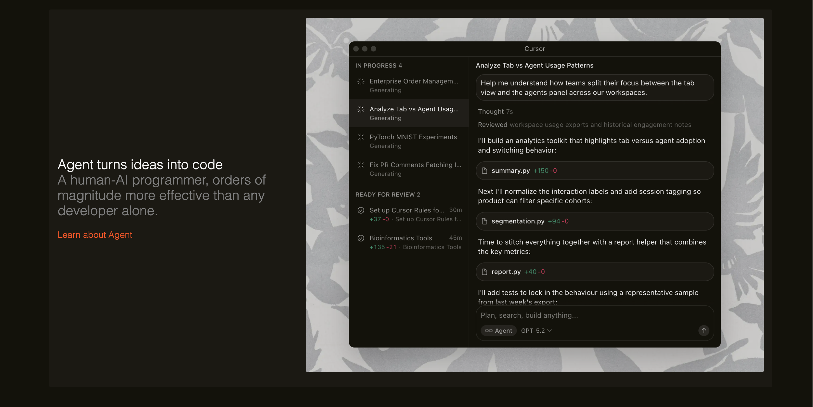
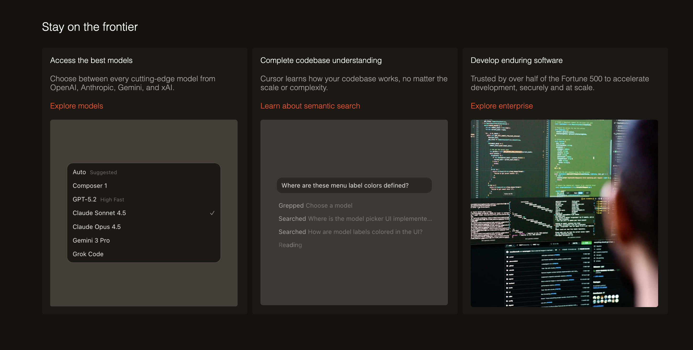
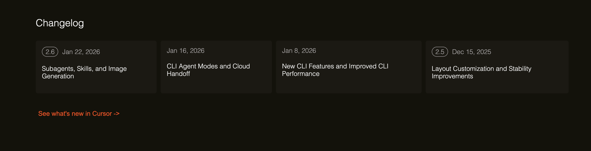
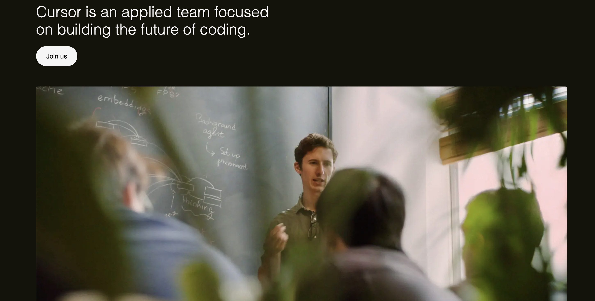
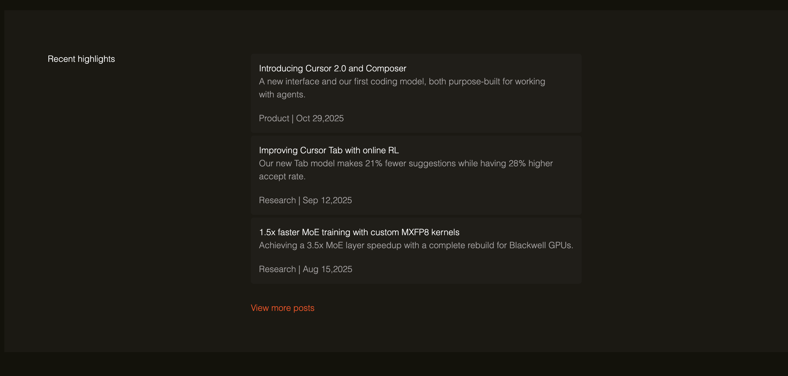
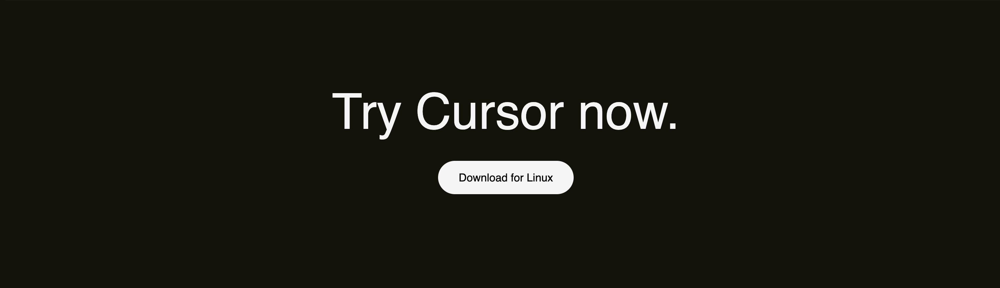

# Cursor Landing Page Clone

This project is a front-end recreation of the Cursor official landing page UI, built using **HTML5** and **CSS3**. The objective was to closely match the original website’s layout, spacing, typography, and dark-themed visual style while keeping the implementation simple and framework-free.

---

## Sections Recreated

### Navigation Bar 

A fixed navigation bar containing the Cursor logo, primary navigation links (Features, Enterprise, Pricing, Resources), and action buttons for Sign In and Download.

---

### Hero Section

The hero section includes the main headline, a primary call-to-action button (“Download for macOS”), and a large hero image showcasing the product interface.

---

### Trusted By Section

A horizontally aligned logo strip representing companies and organizations that use Cursor.

---

### Features Section

Three large feature blocks with alternating layouts, each consisting of descriptive text and a corresponding product image:
- Agent turns ideas into code  
- Magically accurate autocomplete  
- Everywhere software gets built  

---

### Testimonials Section

A grid-based testimonials section displaying user quotes along with profile images, names, and professional roles.

---

### Feature Cards Section

Three card-style highlights focusing on:
- Access to the best AI models  
- Complete codebase understanding  
- Enterprise-scale development  

---

### Changelog Section

Version cards displaying recent updates, release dates, and brief descriptions of new features and improvements.

---

### Team & Careers Section

A section highlighting the Cursor team’s mission with a supporting image and a call-to-action to join the team.

---

### Recent Highlights Section

A blog-style layout showcasing recent product and research updates with titles, descriptions, and dates.

---

### Final Call-to-Action

A closing call-to-action encouraging users to try Cursor, with a Linux download button.

---

### Footer

A multi-column footer containing Product, Resources, Company, Legal, and Social links, along with branding and theme controls.

---

## Fonts and Colors Used

### Fonts
- **Primary Font:** Helvetica, sans-serif  
- **Secondary Font:** Manrope (used mainly for navigation links)  
- Font weights range from 100 to 400 to maintain a clean, modern look.

### Colors
- **Primary Background:** `rgb(20, 18, 11)`
- **Secondary Background / Cards:** `rgb(27, 25, 19)`
- **Hover Background:** `rgb(29, 27, 21)`
- **Primary Text:** `whitesmoke`
- **Muted Text:** `rgb(163, 160, 160)`
- **Accent Color (Links & Highlights):** `orangered`
- **Buttons:**  
  - Light background with dark text for primary CTAs  
  - Dark background with light text for secondary actions  

